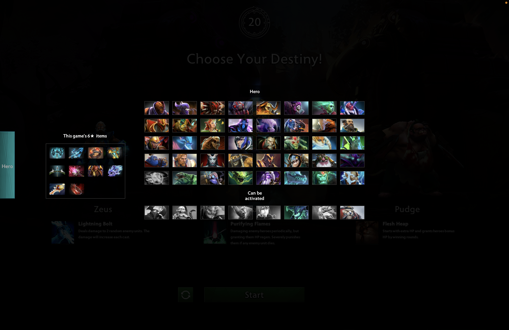
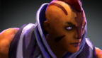
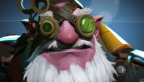
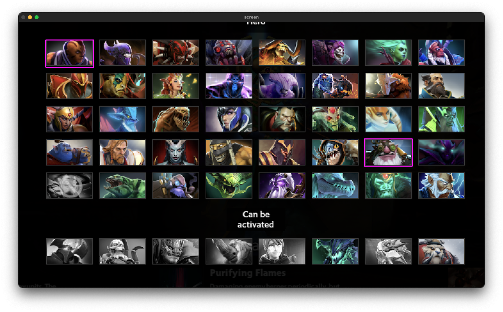

(WIP)

Summary
---

Technical requirement: I want to monitor a part of my screen and capture when a pre-defined image appear.

Background: This is narrowly inspired by a casual game that I'm playing (Dota's Atomic War custom game)

In every match, a pool of 40 hero is randomly chosen from the full roster of close to 100 of heroes. When the heroes are shown. players have 30 seconds to prepare for their strategy. To maximize their chance of winnings, players need to quickly identify the strongest and most flexible combos, and come up with a plan for counterplay.

Tools used: [openpycv](https://opencv.org/) and [mss](https://python-mss.readthedocs.io/)

Sample
---
|Description|Image|
|:-:|:-:|
|**Game's feed** (taken from primary monitor)||
|**Template** What I want to look for| |
|**Result** (separate windows from secondary monitor. You can see the purple boxes showing found images||